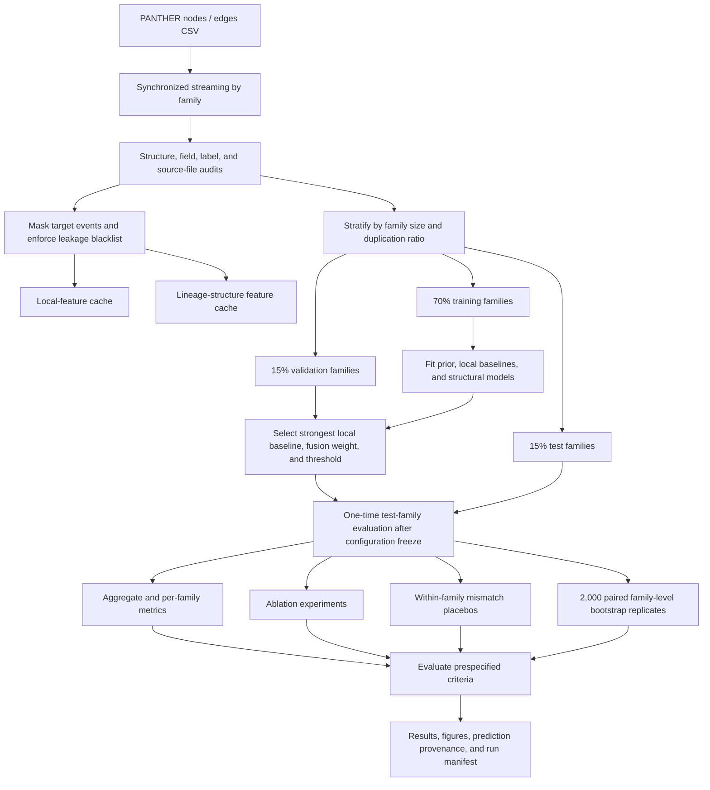

# Generalizing PRIME to PANTHER Biological Lineage Data: A Feasibility Study of Lineage Data Circulation Value

This directory provides a standalone, reproducible, and auditable feasibility study testing whether PRIME's principles of lineage anchoring, provenance traceability, and structure-enhanced reasoning can transfer from human genealogy tasks to PANTHER 19.0 protein-family phylogenetic trees. The primary task is to distinguish `speciation` from `duplication` after ancestral-node event labels have been completely masked.

The broader purpose is not to build another domain-specific classifier, but to test a reusable cross-domain data mechanism: once distributed records are anchored to traceable lineage coordinates, can information previously confined to local nodes or historical archives flow along temporal or relational structures toward new reasoning targets and create measurable, attributable, and auditable downstream value? The genealogy-based population experiment converts strictly lagged birth and death events into regional population-forecasting priors along a calendar timeline. This experiment converts node, branch, and descendant context into evidence for inferring missing event annotations along a phylogenetic relationship axis. The two experiments are not the same computational pipeline, but they test the same architectural invariants of what PRIME calls dynamic data circulation.

This experiment does not modify the paper, code, or existing results in `experiments/paper_experiment`; the paper's account of PRIME is used only to identify the design principles to preserve during transfer. All raw data, caches, splits, models, statistical tests, and conclusions in this directory are self-contained.

## 1. Refined Experimental Thesis: From Data Preservation to Data Circulation

### 1.1 Central Claim in One Sentence

**This experiment shows that, when provenance, entities, and relationships are traceable, the value of lineage data lies not only in preserving existing facts but also in enabling structural context to be reorganized across nodes, branches, and unseen families into downstream reasoning evidence. Its incremental value over local information, together with its dependence on correct structural alignment, constitutes bounded cross-domain evidence for PRIME's data-circulation capability.**

Here, "data circulation" does not mean copying files, making them openly downloadable, trading them, or indiscriminately pooling all data. It refers to a constrained information lifecycle:

```text
Data objects with traceable provenance
        ↓
Entity and lineage-coordinate anchoring
        ↓
Propagation and aggregation of valid context along temporal or relational axes
        ↓
Conversion into priors, features, or reasoning evidence usable by a new target
        ↓
Validation of incremental value through baselines, mismatch controls,
extrapolative splits, and audits
```

Data are considered to have generated "circulation value" only if all of the following hold:

1. **Locatable:** Information can always be traced to a specific node, family, and source file.
2. **Connectable:** Data enter a shared coordinate system through meaningful temporal or lineage relationships, rather than mere concatenation.
3. **Reusable:** Relational context can serve a new task beyond the records' original purpose.
4. **Beneficial:** Frozen test performance improves over a baseline that sees only the target's local information.
5. **Attributable:** Value decreases when node–context correspondence is disrupted, showing that the gain depends on real information flow rather than a larger feature space alone.
6. **Extrapolative:** Value persists in families excluded from training rather than being limited to memorization within the same tree.
7. **Auditable:** Labels, provenance, and split boundaries are clear; any leakage or family overlap invalidates the conclusion.

For metrics where higher is better, incremental reuse value is:

\[
\Delta V_{\mathrm{reuse}}
=M(\text{local + lineage})-M(\text{local only}),
\]

and the contribution of true relational structure is:

\[
\Delta V_{\mathrm{alignment}}
=M(\text{aligned lineage})-
\mathbb{E}\left[M(\text{within-family mismatched lineage})\right].
\]

For metrics such as log loss, where lower is better, the difference is reversed. The experiment does not compress different metrics into a single commercial-value score. These two reproducible controls separately answer whether lineage information is useful and whether its value comes from correct data relationships.

### 1.2 Cross-Domain Correspondence Between the Genealogy Population and PANTHER Experiments

| Mechanism stage | Genealogy-enhanced regional population forecasting | PANTHER biological-lineage experiment | Shared PRIME principle tested |
|---|---|---|---|
| Data objects | Individual births, deaths, generations, and genealogical sources | Protein-family nodes, parent–child edges, branches, and non-event attributes | Data objects retain identity and provenance first |
| Circulation coordinates | Region–year timeline and genealogical generation axis | Protein-family phylogenetic relationship axis | Distributed records enter a meaningful shared coordinate system |
| Lineage anchors | Individual/branch, generational position, source genealogy, and coverage years | `family_id + node_id + parent_of` | Anchors constrain whose evidence it is and where it came from |
| Circulation process | Aggregate pre-target-year birth/death pressure into a population-forecasting prior | Aggregate child, sibling, depth, subtree, and branch context into node-level evidence | Historical or relational context becomes computable information |
| Downstream task | Predict regional population change | Recover masked `speciation/duplication` annotations | Archival/structural data are reused for a new inference target |
| Local control | Model using only historical population series | Model using only the target node's own information | Measure the net gain from lineage information |
| Circulation-validity controls | Temporal lagging, coverage constraints, no-genealogy prior/placebo analyses | Family-disjoint splits, structural ablations, and within-family mismatch placebos | Exclude future information, mismatched relationships, and apparatus effects |
| Value boundary | Historical regional population forecasting, without extrapolating to modern demographic laws | Annotation recovery on a single-version tree, without extrapolating to sequence-mechanism discovery | Application value must be reported with its evidential scope |

These experiments provide complementary rather than redundant evidence. The genealogy population experiment shows that lineage records can flow along a temporal axis into an external regional-level prediction task. The PANTHER experiment shows that the same governance logic can cross from sociohistorical data to biological knowledge data and transform local records into missing-information recovery along a relational axis. The former emphasizes reuse across time and tasks; the latter emphasizes reuse across nodes, families, and domains. Their shared thesis is that **the long-term value of data depends not only on scale and accessibility, but also on whether provenance, identity, and relationships are preserved during circulation.**

### 1.3 What the Current Experiment Can Validate

| Evidence level | Status | Basis |
|---|---|---|
| Auditable provenance and relationships | Validated | Source-file hashes, node/edge integrity, and per-prediction provenance |
| Incremental reasoning value of lineage context | Validated | `prime_fusion` significantly improves upon the strongest local baseline |
| Dependence of the gain on true relational alignment | Validated | AUROC with true structure is significantly higher than within-family mismatch placebos |
| Transfer to unseen lineage units | Validated | Training, validation, and test families are completely disjoint |
| Incremental updates as data evolve across versions | Not validated | Only one PANTHER 19.0 snapshot is used |
| Multi-source circulation across databases | Not validated | Independent sources such as Ensembl and OrthoDB are not integrated |
| Practical improvement in biological research or manual-annotation cost | Not directly validated | The endpoint is event-annotation recovery, not real workflow utility |

Thus, the experiment supports measurable reasoning value from relational lineage-data circulation, but cannot alone establish complete dynamic version circulation, multi-source collaboration, or real-world business value.

## 2. Research Questions and Prespecified Tests

The central question is not whether new biological laws can be discovered from DNA sequences. Rather, when event annotations are treated as missing information, can the lineage anchoring, structural context, and traceable reasoning emphasized by PRIME allow information distributed across a tree to flow toward a target node and reliably recover that annotation in unseen protein families?

- **H1: Structural gain.** Lineage-structure features excluding event labels should significantly outperform a local baseline using only the target node's own information.
- **H2: Cross-family generalization.** The gain should hold on a family-disjoint test set rather than arise from placing nodes of the same family in both training and test sets.
- **H3: Alignment specificity.** True node–lineage-context alignment should outperform a placebo that preserves family distributions while disrupting node–structure correspondence.
- **H4: Family-level robustness.** Improvement should appear in both node-weighted aggregate metrics and equally weighted per-family metrics with paired bootstrap intervals.
- **H5: Auditable circulation.** Every prediction must retain a provenance anchor, and all structural, leakage, and family-overlap audits must pass; otherwise, even strong performance is not evidence of data circulation in the PRIME sense.

The unit of analysis is an ancestral node with a modelable event label. The positive class is fixed as `duplication` and the negative class as `speciation`. All decision thresholds were fixed before inspecting test results; the test set is never used to choose models, fusion weights, or classification thresholds.

## 3. Scope of Claims

- The data are protein-family phylogenetic trees and annotations, not raw DNA/nucleotide sequences.
- They come from one PANTHER 19.0 release, so the experiment does not validate cross-database, multimodal, or multi-source P+I.
- The experiment can test auditable P, tree-structure integration, and R+M-style missing-annotation reasoning; predictive metrics cannot directly validate E.
- The data are a static, single-version snapshot. "Circulation" means information enters downstream reasoning along traceable lineage relationships; it does not mean a continuously updated real-time pipeline has been validated.
- PANTHER event labels are related to tree-construction and annotation procedures. Results are interpreted as bounded transfer in structured-annotation recovery, not discovery of new biological mechanisms.
- High performance shows that existing tree structure contains strong event-discriminative signals; it is not unconditional generalization to raw sequences, other databases, or true evolutionary causality.

## 4. Data Structure, Scale, and Experimental Value

### 4.1 Input Files

| File | Granularity | Primary role |
|---|---|---|
| `data/PANTHER_nodes.csv` | One tree node per row | Provides `node_id`, `family_id`, node type, species/biological code, branch information, and event annotations |
| `data/PANTHER_edges.csv` | One directed parent–child edge per row | Provides `source_id -> target_id`, `parent_of`, and edge branch lengths |

Both CSVs are grouped contiguously by `family_id`. The reader synchronizes the node and edge tables and processes one family at a time, retaining only one tree in memory and avoiding loading nearly 1 GB of raw data at once. Raw files are read-only; cache validity is recorded through source-file sizes, the feature contract, and SHA-256 hashes in the audit.

### 4.2 Full-Data Overview

| Item | Count |
|---|---:|
| Protein families | 15,683 |
| Nodes | 3,564,945 |
| Directed edges | 3,549,262 |
| `speciation` target nodes | 1,158,521 |
| `duplication` target nodes | 381,819 |
| Total binary-classification target nodes | 1,540,340 |
| `coded_event` nodes reported separately and excluded from binary classification | 7,415 |

Every family passes checks for a single root, edge count equal to node count minus one, unique node primary keys, valid edge endpoints, a unique parent per non-root node, consistent family membership, and consistent relationship types. `confidence`, `taxon_id`, and `duplication_flag` are entirely empty and excluded from modeling. Partial missingness in `label` and `event_type` mainly reflects differences in field applicability between ancestral and extant nodes.

These data provide explicit tree structure, maskable ancestral-event labels, family boundaries, and node-level provenance identifiers. They are therefore well suited to testing whether lineage structure can complete missing annotations while supporting strict out-of-family extrapolation and per-prediction provenance audits. From a circulation perspective, the node table supplies locatable data objects, the edge table valid propagation channels, the masking task a downstream use, and the local baseline plus mismatch placebos counterfactual references.

## 5. Operationalizing PRIME in the PANTHER Task

| PRIME function | Executable definition | Observable evidence |
|---|---|---|
| P: Provenance | Bind predictions to nodes, families, and source files | Every test prediction retains `node_id`, `family_id`, `source_file`, and `split` |
| I: Integrated | Unify node attributes and `parent_of` edges into complete family trees | Audits of roots, edges, endpoints, family membership, and parent–child relationships |
| R: Reasonable | Constrained inference from topology and branch context excluding target events | Structural expert, joint model, ablations, and placebos |
| M: Malleable | Reorganize lineage data into updatable feature caches and missing-annotation inputs | Explicit masking, missingness indicators, rebuildable caches, and post-freeze reevaluation |
| E: Endorsed | Requires community review, authorization, and continuing governance | This experiment provides only a technical audit and cannot claim that E generalized |

The lineage anchor is uniquely identified by `family_id + node_id`, while `parent_of` edges connect the target to ancestors, siblings, children, and descendant leaves. The anchor determines which node structural evidence belongs to; it does not use the node identifier as a predictive feature. P+I ensure information retains provenance and relational meaning before circulation, while R+M test whether it can become new reasoning value. Both layers are necessary.

## 6. Overall Experimental Framework



The training set fits models; the validation set selects the local baseline, fusion weight, and classification thresholds; the test set is used only for post-freeze performance, robustness analyses, and prespecified decisions. The family is the smallest split unit, and no `family_id` is shared among sets.

## 7. Complete Experimental Procedure

### Stage 1: Raw-Data Audit

1. Traverse the two `family_id`-sorted CSVs synchronously and verify one-to-one family correspondence.
2. Within each tree, verify unique node IDs, valid edge endpoints, no self-loops, and one parent for every non-root node.
3. Check for one root, connected reachability, `n_nodes - 1` edges, and `parent_of` relationships.
4. Verify copied parent-event and branch-length fields in the edge table against the node table; these fields are audit-only and never features.
5. Summarize field missingness, node/event types, target classes, and family sizes; record source paths, sizes, and SHA-256 hashes.
6. If any critical structural or leakage check fails, mark the conclusion `invalid_due_to_audit_failure`.

### Stage 2: Target Definition and Masking

1. Retain only ancestral nodes whose events are `speciation` or `duplication`.
2. Fix `speciation = 0` and `duplication = 1`.
3. Do not force `coded_event` into the binary task; report it separately.
4. Remove all event-related inputs from every target; retain labels only in a separate `y` array.

### Stage 3: Leakage-Safe Feature Extraction

The local baseline sees only intrinsic target-node information valid after label masking. The lineage expert sees only context derived from topology, branches, and non-event child attributes. Feature names pass a fail-closed contract before modeling; any field containing events, NHX event codes, or raw-node-identifier semantics raises an exception.

### Stage 4: Deterministic Family-Level Splitting

1. Compute node count and `duplication` ratio per family.
2. Discretize both using their 20th, 40th, 60th, and 80th percentiles.
3. Shuffle with a fixed seed within each family-size-bin × duplication-ratio-bin stratum.
4. Assign approximately 70%/15%/15% of families to training/validation/test. Small strata use conservative rules ensuring all global sets exist.
5. Write `split_manifest.csv`, recompute intersections, and fail if any family overlaps.

For seed 42, the full split contains 10,976/2,352/2,355 training/validation/test families and 1,084,313/227,224/228,803 target nodes.

### Stage 5: Model Training

All models are fitted only on training families. Logistic regression uses `class_weight="balanced"`; HistGradientBoosting uses weights derived from training class frequencies. Fixed boosting parameters are `max_iter=100`, `max_leaf_nodes=31`, `learning_rate=0.08`, and `l2_regularization=1.0`; no hyperparameters are searched on the test set.

Diversity, missingness ratio, and ancestral-node ratio among direct-child taxa form the PRIME lineage expert's "child composition" group. They implement aggregation and directed circulation from lineage anchors along parent–child relationships, so they are an internal PRIME mechanism rather than a separate external baseline.

### Stage 6: Validation Selection and PRIME Fusion

1. Select the strongest local baseline between `local_logistic` and `local_hgb` by validation log loss.
2. Generate fusion probabilities:

   \[
   p_{\mathrm{PRIME}}=(1-w)p_{\mathrm{local}}+w p_{\mathrm{lineage}},
   \qquad w\in\{0,0.01,\ldots,0.50\}.
   \]

3. Select `w` by validation log loss only. The 0.50 cap encodes conservative augmentation of local evidence.
4. Select each binary threshold on validation macro-F1 only.
5. Freeze model, weight, and threshold; do not tune on test data.

### Stage 7: Test Evaluation and Robustness

1. Compute aggregate metrics over all test target nodes from every unseen family.
2. Compute within-family metrics and average families equally so large families do not dominate.
3. Run 2,000 paired bootstrap replicates on per-family log-loss and macro-F1 differences between the strongest local baseline and PRIME fusion.
4. Run 100 within-family structural-mismatch placebos, preserving class and structural distributions while shuffling node–lineage-probability correspondence.
5. Run 100 global node-mismatch placebos to disrupt node–context correspondence across families.
6. Compare four mutually exclusive feature-group-only models with four strict leave-one-group-out models, testing both sufficiency and redundancy.
7. Permute each feature five times within test families and measure the full lineage expert's AUROC drop.
8. Stratify by family size, duplication ratio, normalized depth, and root status using validation-frozen thresholds.
9. Plot learning curves using 10%, 25%, 50%, and 100% of training families.
10. Repeat local, full-lineage, and fusion comparisons under split seeds 42, 43, and 44, holding model randomness fixed.

### Stage 8: Prespecified Decisions and Reporting

The script generates `acceptance_criteria.json` from frozen rules and renders the machine conclusion in `RESULTS.md`. Every node-level prediction retains complete provenance. Five standalone primary figures show AUROC–AUPRC performance, per-family gains, structural-alignment controls, feature-group sufficiency/redundancy, and calibration. Nine additional figures cover learning curves, permutation importance, split sensitivity, all subgroups, class errors, fusion weights, two bootstrap distributions, and placebo distributions. All figures are 50 mm high, have no in-panel title, and export to PNG, PDF, SVG, and EMF.

## 8. Feature Definitions and Leakage Control

### 8.1 Local Features

| Feature | Meaning |
|---|---|
| `incoming_branch_length` | Branch length of the target node's incoming edge |
| `is_root` | Whether the target node is the family root |
| `incoming_branch_missing` | Whether the incoming-edge branch length is missing |

### 8.2 Lineage-Structure Features

| Feature group | Features | Information represented |
|---|---|---|
| Position and scale | `log_outdegree`, `normalized_depth`, `log_sibling_count`, `log_family_nodes` | Tree position, immediate branching, and family scale |
| Descendant structure | `log_subtree_nodes`, `log_descendant_leaves` | Subtree size and descendant-leaf count |
| Child-branch context | `child_branch_mean/std/min/max/zero_fraction` | Direct-child edge-length distribution and zero-length ratio |
| Child-node composition | `child_ancestral_fraction` | Proportion of direct children that are ancestral nodes |
| Biological-code context | `child_taxon_diversity`, `child_taxon_missing_fraction` | Diversity and missingness of species/biological codes among direct children |

Count features use `log1p`; depth is divided by family maximum depth. Features describe only the tree and non-event attributes and never read event labels of the target or adjacent nodes.

### 8.3 Strict Leakage Blacklist

The following never enter a model matrix:

- `event_type`, `event_type_raw`, and all target-node event fields;
- `Ev` within `nhx_attributes`, and the entire `nhx_attributes` field;
- edge-table `parent_event_type`;
- `duplication_flag`;
- `raw_node_id` and ordering, prefix, or numeric patterns derived from raw node identifiers.

`parent_event_type` only verifies agreement between edge-table copied labels and parent nodes. Output `node_id`, `family_id`, and `source_file` serve only provenance and grouping and never enter features.
